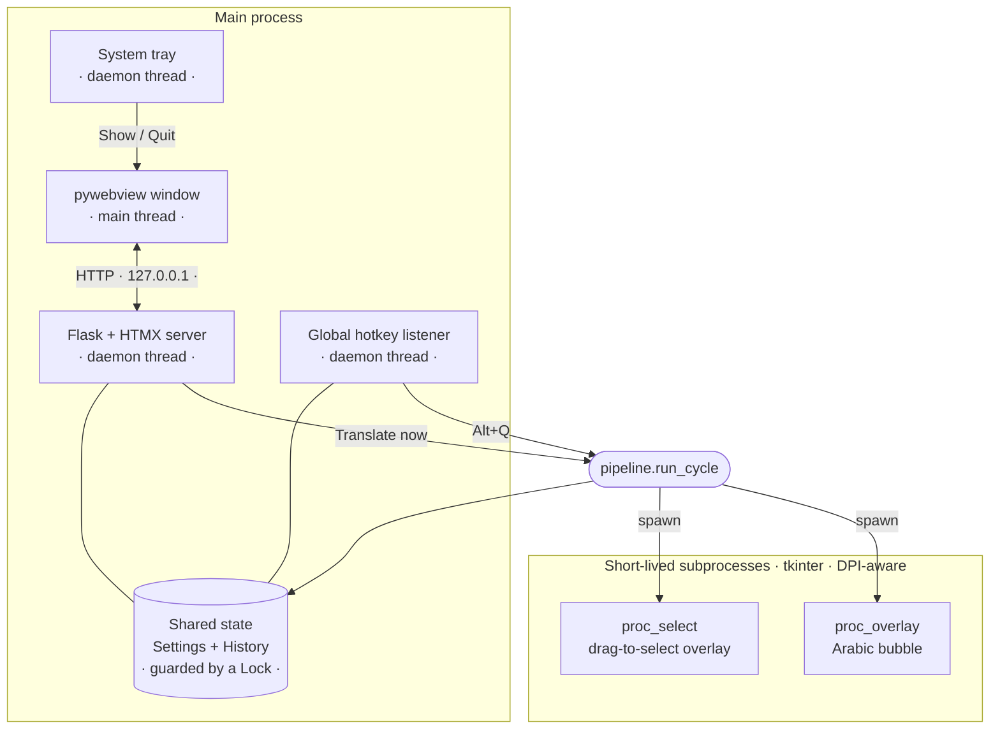
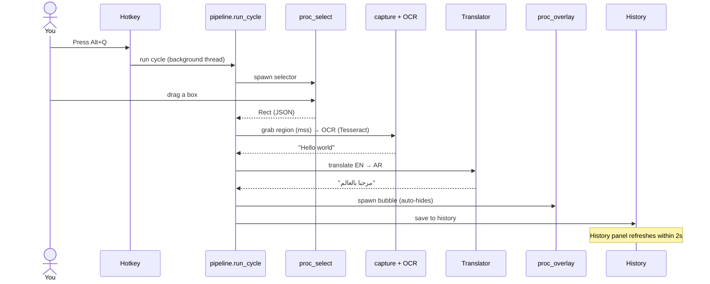

# OverlayTranslator

Translate on-screen **English → Arabic** without leaving what you're doing. Press
a hotkey, drag a box over any English text, and an Arabic bubble appears right
above it. OCR runs **locally**; translation uses **keyless** free web endpoints —
no account, no API key.

- 🖱️ **Grab-and-translate** — global hotkeys:
  **Alt+Q** (translate), **Alt+W** (set OCR region), **Alt+E** (toggle auto-translate).
- 🔒 **Keyless** — Google, Bing, or DeepL via free web endpoints. No signup.
- 🧠 **Local OCR** — Tesseract; only the text you select ever leaves your machine.
- 🪟 **Native app** — HTMX UI in a pywebview window, creamy-beige light / warm
  espresso dark, lives in the system tray.
- 🕘 **History** — every translation saved locally; copy, delete, clear.

---

## How it works

pywebview owns the GUI main thread, so the **UI**, the **Flask server**, the
**global hotkey**, and the **tray** all run in one process (Flask/hotkey/tray on
daemon threads). The screen **selector** and the result **bubble** are tkinter,
which *can't* share that main thread — so they run as short-lived, DPI-aware
**subprocesses**. Everything shares one `Settings` + `History` behind a lock.



A single translation flows like this:



---

## Setup

1. Install **Python 3.11** and **Tesseract OCR** (Windows):
   ```
   winget install UB-Mannheim.TesseractOCR
   ```
   The app auto-detects the default Tesseract install location.
2. Install dependencies:
   ```
   python -m pip install -r requirements.txt
   ```
3. Run it:
   ```
   python main.py
   ```
   or double-click **`run_overlay_translator.bat`** (installs deps on first run).

No account or API key needed.

## Usage

- **Alt+Q** (or your chosen hotkey) — drag a box over English text.
- **Alt+W** (or your chosen OCR-region hotkey) — set/update a fixed OCR region.
- **Alt+E** (or your chosen auto-toggle hotkey) — start/stop auto-translation mode.
- **Esc** or **click the bubble** — dismiss early (otherwise it auto-hides).
- Close the window → hides to the tray (hotkey keeps working). **Quit** from the
  tray menu exits.

The window has three sections:

| Section | What it does |
|---|---|
| **Home** | Status, current hotkey/engine, and a **Translate now** button. |
| **History** | Past translations (source → Arabic + time); copy, delete, clear — updates live. |
| **Settings** | Record translate/region/auto hotkeys, set OCR region, start/stop auto translate, auto-hide timer, engine, bubble font size, start with Windows, light/dark theme. |

### Fullscreen game note

True exclusive fullscreen games can lose focus when the selector overlay opens,
which minimizes the game. Use **saved OCR region + auto-translate** so you don't
open the drag selector during gameplay, and prefer **Borderless Windowed**
instead of exclusive fullscreen when possible.

## Translation engines

All keyless (no signup), switchable anytime in Settings:

| Engine | Notes |
|---|---|
| **Google** | Reliable, good quality. Default. |
| **Bing** | Reliable, quality close to DeepL. |
| **DeepL** | Best Arabic quality. Uses DeepL's free web endpoint the same way Translumo/DeepLX do, so it's **rate-limited by IP (HTTP 429)** — works on most home connections but can be blocked on shared/VPN/datacenter IPs. On failure the app retries once, then suggests switching engine. |

Translation needs internet; OCR runs locally.

## Configuration & data

Stored next to `main.py` (both git-ignored):

- **`settings.json`** — hotkey, engine, auto-hide seconds, font size, theme.
- **`history.json`** — the last 200 translations (newest first).

## Project structure

```
src/overlay_translator/
├── pipeline.py        select → capture → OCR → translate → overlay → history
├── webapp.py          host: starts threads + pywebview window
├── app.py             entry point (run)
├── web/
│   ├── state.py       AppState — shared Settings/History/engine + Lock
│   └── server.py      Flask routes (HTML fragments for HTMX)
├── templates/         HTMX fragments (shell, home, history, settings)
├── static/            app.css (creamy-beige/espresso) + htmx.min.js (vendored)
├── proc_select.py     subprocess: drag-to-select overlay  ┐ tkinter,
├── proc_overlay.py    subprocess: Arabic bubble           ┘ DPI-aware
├── selector.py        selection overlay logic
├── overlay.py         bubble logic
├── capture.py         screen capture (mss)
├── ocr.py             OCR (pytesseract)
├── translate.py       Google / Bing / DeepL engines
├── arabic.py          RTL display helper
├── hotkey.py          global hotkey manager
├── tray.py            system-tray icon
├── dpi.py             per-monitor DPI awareness (correct high-DPI selection)
├── settings_store.py  settings.json load/save
├── history_store.py   history.json load/save (stable ids)
└── models.py          Rect
```

## Development

```
python -m pytest -q
```

The pure logic (settings, history, translation engines, the pipeline, and every
Flask route) is unit-tested; the GUI/host pieces are verified manually.

## Tech stack

Python · Flask · HTMX · pywebview (WebView2) · pystray · keyboard · mss ·
pytesseract (Tesseract) · deep-translator / translators · pyperclip.
